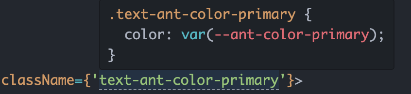

<p align='center'>
  <a style='margin-right: 16px' href='https://tailwindcss.com/docs/presets' target="_blank" rel='noopener noreferrer'>
    
  </a>
  <a href='https://ant.design/docs/react/css-variables-cn' target="_blank" rel='noopener noreferrer'>
    
  </a>
</p>


<h1 align='center'>tailwind-antd-preset</h1>

> Use antd css variables in tailwindcss

## Install

```bash
npm install tailwind-antd-preset -D
```

## Usage

### tailwind.config.js
```js
/** @type {import('tailwindcss').Config} */
module.exports = {
  presets: [require('tailwind-antd-preset')],
}
```

### In React

```tsx
<div className='text-ant-color-primary'></div>
// ===> color: var(--ant-color-primary);
```


